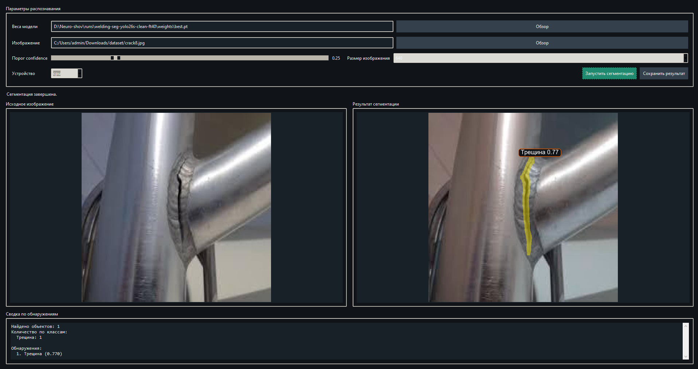
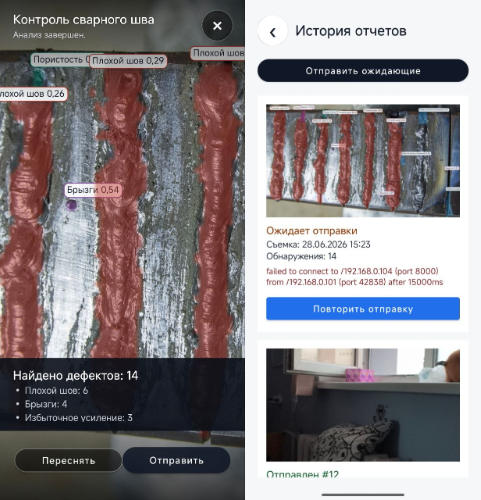

# Нейро-шов

Проект для автоматического контроля дефектов сварных швов по фото. (Computer Vision)

- **Desktop GUI** — локальная проверка изображений на ПК через YOLO segmentation.
- **Android-приложение** — съемка шва, офлайн-анализ прямо на телефоне, отправка отчета на сервер.
- **Django backend** — хранение пользователей, организаций, проверок, геолокации, исходных фото, изображений с разметкой и JSON-результатов анализа.

## Модель

Используется YOLO segmentation для поиска и сегментации дефектов сварки.

Актуальные обученные модели:

- `runs/welding-seg-yolo26s-e100/weights/best.pt` — основной чекпоинт.
- `runs/welding-seg-yolo26s-clean-ft40/weights/best.pt` — дообученная/очищенная версия.

Android использует офлайн-модель:

```text
android/app/src/main/assets/welding_seg_float32.tflite
```

Это TensorFlow Lite-версия модели `yolo26s-clean-ft40`. Анализ выполняется на устройстве, без запроса к серверу. Backend нужен только для авторизации и загрузки готового отчёта.

## Что отправляет приложение

После анализа приложение отправляет на Django API:

- пользователя и время проверки;
- исходное фото;
- фото с результатом анализа;
- геолокацию, если доступна;
- версию модели;
- JSON с найденными дефектами.

## Структура

```text
android/   Android-приложение с офлайн TFLite-инференсом
backend/   Django REST backend для отчётов и админки
scripts/   подготовка датасета, обучение и валидация YOLO
runs/      сохранённые результаты двух актуальных моделей
app.py     desktop GUI для проверки модели на фото
```

## Скриншоты

### Desktop GUI



### Android-приложение




## Быстрый запуск

### Desktop GUI

```powershell
python app.py
```

### Backend

```powershell
cd backend
python -m venv .venv
.\.venv\Scripts\Activate.ps1
pip install -r requirements.txt
Copy-Item .env.example .env
python manage.py migrate
python manage.py seed_demo
python manage.py runserver 0.0.0.0:8000
```

В текущей локальной версии используется SQLite (backend/db.sqlite3). PostgreSQL предусмотрен конфигом для production.

```text
DB_ENGINE=sqlite
```

### Android

Открыть папку `android/` в Android Studio и запустить приложение.

Для эмулятора URL backend:

```text
http://10.0.2.2:8000/
```

Для реального телефона — IP компьютера в локальной сети, например:

```text
http://192.168.1.25:8000/
```

## API

Основной endpoint загрузки отчёта:

```text
POST /api/inspections/
```
